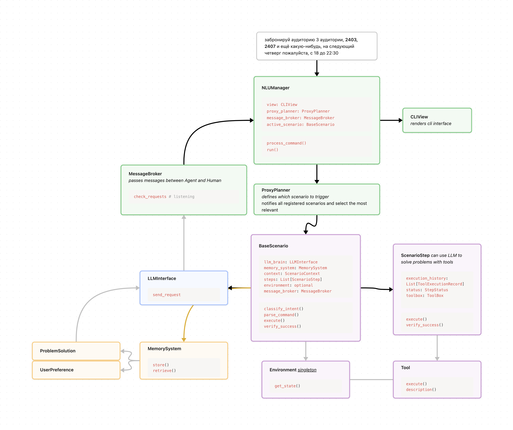

# Club Manager Assistant Agent
## Main Idea

This project implements an autonomous agent powered by Large Language Models (LLM) to help club managers with routine tasks like hall booking, posts writing, managing daily passes for guests, etc. *For now it is focused on autonomous managing booking halls for events.*

The agent can:
- Process natural language commands
- Define which scenario should be used
- Break down complex tasks into manageable steps 
- Request human assistance when needed


Example command:
> "забронируй аудиторию 3 аудитории, 2403, 2407 и ещё какую-нибудь, на следующий четверг пожалуйста, с 18 до 22:30, "

The agent handles the entire workflow - from login to form submission, with human intervention only when necessary for critical decisions or error resolution.
## Repo discription
```bash
.
├── Dockerfile                    # Container definition for running the application
├── README.md
├── config.yaml.example           # Template configuration file for new deployments
├── docker-compose.yml           # Multi-container Docker composition definition

├── docs/                        # Documentation directory
│

├── src/                        # Source code directory
│   ├── config.py              # Load config file
│   ├── llm_interface.py       # Universal for different provider LLM integration interface
│   ├── message_broker.py      # Handles async communication between components (now between llm and user)
│   ├── nlu_manager.py         # Core file – Assistant itself
│   ├── planner.py            # User NL Task planning logic
│   ├── view.py               # User interface handling, now – cli
│   │
│   ├── scenarios/            # Task execution scenarios
│   │   ├── base.py          # Base scenario class and common functionality
│   │   ├── booking/         # Halls booking specific scenarios (ИСУ ИТМО)
│   │   └── prompts.py       # LLM prompts for LLM analyzing errors and suggesting tools
│   │
│   │
│   └── tools/               # Tool implementations directory
│    ├── base.py                    # defines Tool, EnvTool and ToolBox
│    ├── browser/                   # Browser automation tools directory
│    │   ├── base.py               # Base class for browser-specific tools
│    │   ├── booking_utils.py      # Utility functions for room booking (interval mapping, room ID extraction, etc)
│    │   ├── click.py              # Tools for clicking elements, handling navigation, filling forms
│    │   ├── dropdown.py           # Tools for interacting with dropdown menus
│    │   ├── get_text.py          # Tools for extracting text content from elements
│    │   ├── environment.py        # Browser environment management and state tracking
│    │   └── meta_tools/          # Complex composite tools combining multiple atomic operations
│    │       ├── book_room_form.py     # Complete room booking form preparation workflow
│    │       └── fill_book_form.py     # Form filling and submission workflow  
│    ├── call_human.py            # Tool for requesting human assistance via message broker
│    └── date.py                 # Handling requestes dates and intervals

├── tests/                   

├── pyproject.toml           # Python project metadata and dependencies
└── uv.lock                  # Dependency lock file
```
## Scheme


## View


## Basic booking flow
1. You ask the assistant to book a room "забронируй аудиторию 3 аудитории, 2403, 2407 и ещё какую-нибудь, на следующий четверг пожалуйста, с 18 до 22:30, "
2. NLUManager asks ProxyPlanner to map command on scenario
3. ProxyPlanner maps command on BookingScenario
4. Booking scenario triggers llm to parse command and extract entities
5. Booking scenario starts browser execution (browser env singleton is created, the same browser is used for all user commands)
6. Booking scenario goint steb by step, recording executiong history. If some step is failed, the llm agent will analyze the error and suggest tools to fix it.
7. If agent need human help, it will ask for it via message broker.
8. The NLUManager listens to the message broker and if it gets a message from the agent, it will ask the user for help.
9. The user will help the agent and the agent will continue the execution, implementing the user's advice.
10. When the scenario is finished, user can input new command or exit the program.

## How to run
1. Run docker compose to init redis message broker
2. Fill config.yaml with your data
3. Run nlu_manager.py
```bash
docker-compose up -d
python src/nlu_manager.py
```

