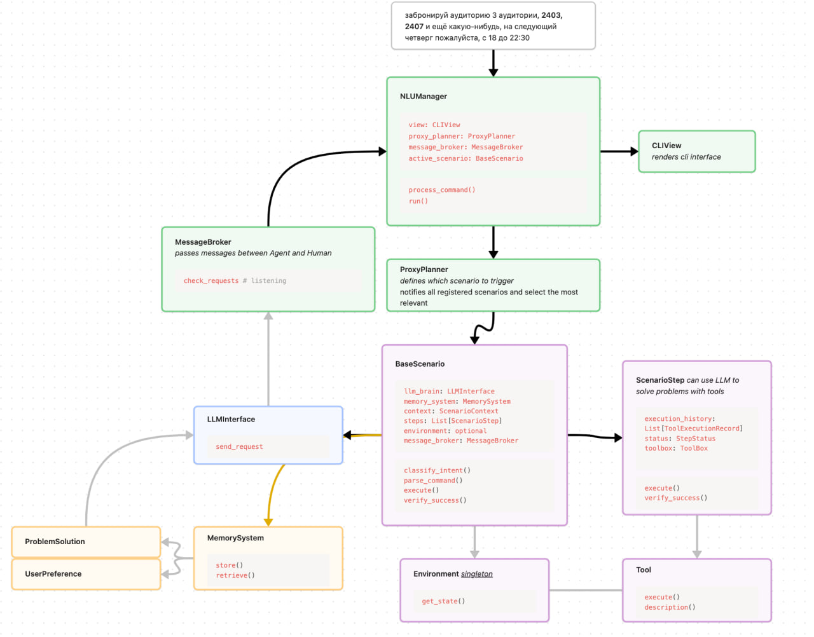
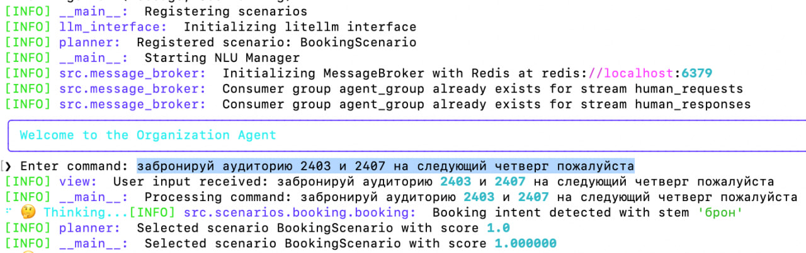

# Club Manager Assistant Agent
## Main Idea

This project implements an autonomous agent powered by Large Language Models (LLM) to help club managers with routine tasks like hall booking, posts writing, managing daily passes for guests, etc. *For now it is focused on autonomous managing booking halls for events.*

The agent can:
- Process natural language commands
- Define which scenario should be used
- Extract and store user preferences
- Break down complex tasks into manageable steps 
- Request human assistance when needed
- Solve problems by using a set of tools, storing successful solutions in memory
- Remember user preferences and previous interactions and retrieve them when needed


Example command:
> "забронируй аудиторию 3 аудитории, 2403, 2407 и ещё какую-нибудь, на следующий четверг пожалуйста, с 18 до 22:30, "

The agent handles the entire workflow - from login to form submission, with human intervention only when necessary for critical decisions or error resolution.
## Repo discription
```bash
.
├── Dockerfile                    # Container definition for running the application
├── README.md
├── config.yaml.example           # Template configuration file for new deployments
├── docker-compose.yml            # Multi-container Docker composition definition


├── src/                         # Source code directory
│   ├── config.py               # Load config file
│   ├── llm_interface.py        # Universal for different provider LLM integration interface
│   ├── message_broker.py       # Handles async communication between components
│   ├── nlu_manager.py          # Core file – Assistant itself
│   ├── planner.py              # User NL Task planning logic
│   ├── view.py                 # User interface handling, now – cli
│   │
│   ├── memory/                 # Memory system for retaining knowledge and experiences
│   │   ├── embeddings.py       # Flexible vector embedding generation for semantic search
│   │   ├── extractor.py        # Extracts preferences and solutions from interactions
│   │   ├── interface.py        # Core memory system interface with ChromaDB
│   │   └── models.py           # Data models for preferences and problem solutions
│   │
│   ├── scenarios/              # Task execution scenarios
│   │   ├── base.py            # Base scenario class and common functionality
│   │   ├── booking/           # Halls booking specific scenarios (ИСУ ИТМО)
│   │   │   ├── booking.py          # Main booking scenario implementation
│   │   │   └── ...                # Booking scenario steps
│   │   └── prompts.py         # LLM prompts for analyzing errors and suggesting tools
│   │
│   └── tools/                 # Tool implementations directory
│       ├── base.py            # Defines Tool, EnvTool and ToolBox
│       ├── browser/           # Browser automation tools directory
│       │   ├── base.py        # Base class for browser-specific tools
│       │   ├── ...           # Basic browser tools like click, fill, etc.
│       │   ├── environment.py # Browser environment management and state tracking
│       │   └── meta_tools/    # Complex composite tools 
│       │       ├── ...
│       ├── call_human.py      # Tool for requesting human assistance
│       ├── call_memory.py     # Tools for querying memory system
│       └── date.py            # Date and interval handling utilities

├── tests/                    # Test suite directory


├── pyproject.toml           # Python project metadata and dependencies
└── uv.lock                  # Dependency lock file
```
## Scheme


## View


## Basic booking flow
1. You ask the assistant to book a room "забронируй аудиторию 3 аудитории, 2403, 2407 и ещё какую-нибудь, на следующий четверг пожалуйста, с 18 до 22:30, "
2. NLUManager asks ProxyPlanner to map command on scenario
3. ProxyPlanner maps command on BookingScenario
4. Booking scenario triggers llm to parse command and extract entities
5. MemorySystem stores user preferences if it is new.
6. Booking scenario starts browser execution (browser env singleton is created, the same browser is used for all user commands)
7. Booking scenario goint steb by step, recording executiong history. If some step is failed, we will try to retrieve alike situation from memory and use it to solve the problem.  The llm agent will analyze the error and suggest tools to fix it, whether based on memory or on current context.
7. If agent need human help, it will look up in something suitable in memory and ask user for help if nothing is found.
8. The NLUManager listens to the message broker and if it gets a message from the agent, it will ask the user for help.
9. The user will help the agent and the agent will continue the execution, implementing the user's advice. We will save the solution in memory.
10. When the scenario is finished, user can input new command or exit the program.

## How to run
1. Run docker compose to init redis message broker
2. Fill config.yaml with your data
3. Run nlu_manager.py
```bash
uv venv .venv
uv sync
docker-compose up -d
source .venv/bin/activate
python src/nlu_manager.py
```

